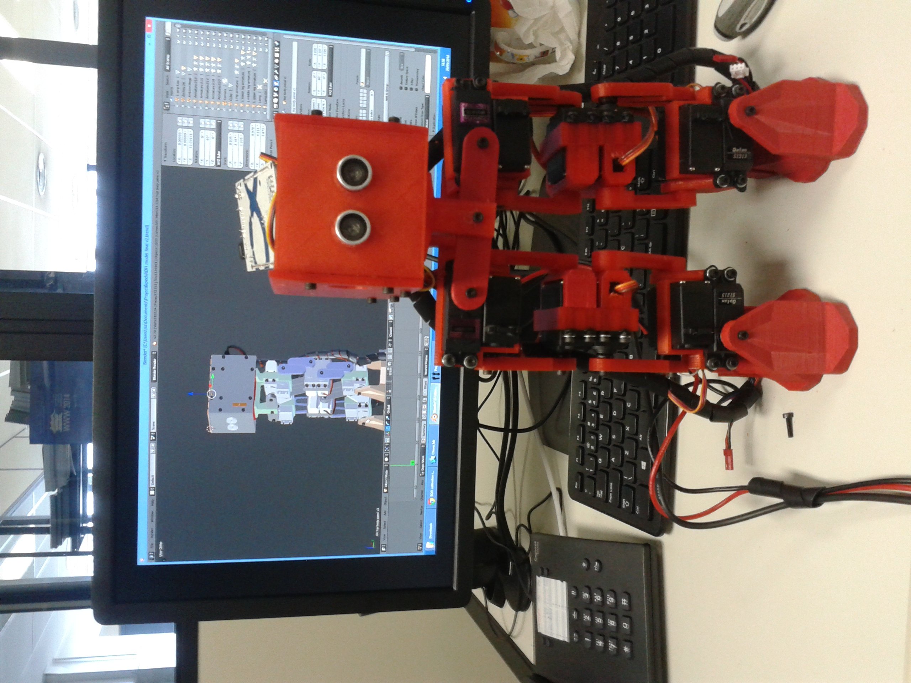

# rofi-biped-robot
Unoficial repository to Rofi biped robot (http://www.projectbiped.com/prototypes/rofi)

####TO-DO_List:####
- [ ] Criar "abraçadeiras" para os servos, para melhorar a extrutura das pernas
- [ ] Manual de ultilização 

